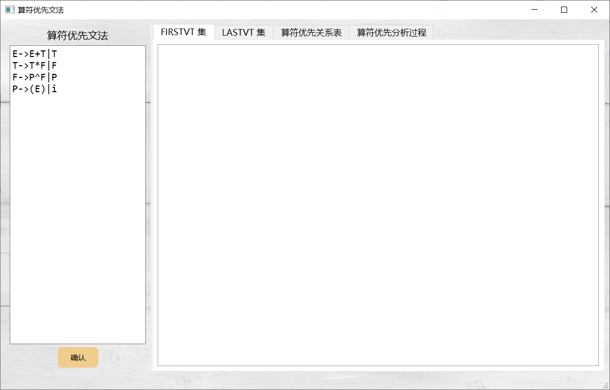
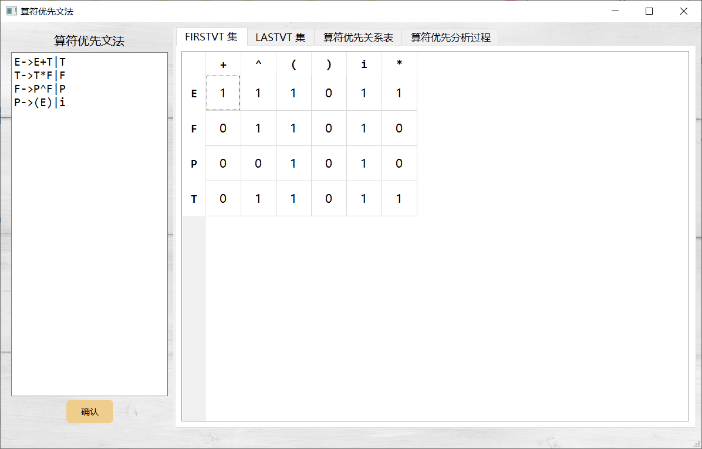
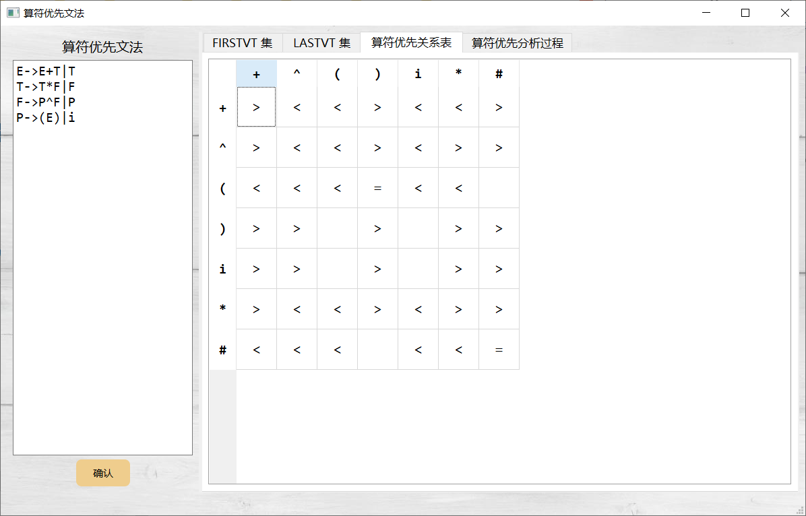
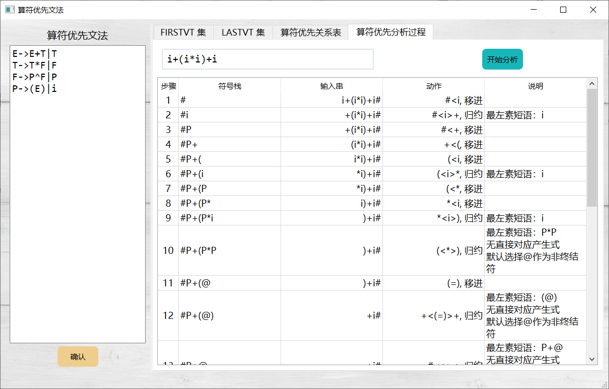

# 编译原理 - 算符优先文法
+ 编译原理题目
+ 日期：2020年8月

## 题目要求

题目23：集合 FIRSTVT(P)构造算法的程序实现

题目24：集合 LASTVT(P)构造算法的程序实现

题目25：算符优先分析算法的程序实现

题目27：优先表构造算法的程序实现

对于用户输入的任意一个算符优先文法，程序自动生成FIRSTVT集、LASTVT集和算符优先分析表，针对该文法，用户输入任意符号串，程序将显示算符优先分析的步骤

## 环境

+ Qt 5.14.0;
+ Qt Creater 4.11.0
+ 编程语言：C++

**注**：运行时项目路径不要包含中文

## 界面操作

（1）主界面

​	点击确认生成FIRSTVT集、LASTVT集、算符优先分析表

（2）FIRSTVT集、算符优先分析表

（3）输入符号串解析过程

